<div align="center">


[](https://git.io/typing-svg)

<picture>
  <source media="(prefers-color-scheme: dark)" srcset="dark.svg">
  <source media="(prefers-color-scheme: light)" srcset="light.svg">
  
</picture>

<br>

[](https://www.linkedin.com/in/yusufseday/)
[](mailto:yusufsedayy@gmail.com)
[](https://github.com/yusufseday)


</div>

---

## About

I am a motivated Computer Engineering student passionate about building a career in cybersecurity and offensive security.

---

## Tech Stack

### Security & Systems


### Languages & Tools


---

## GitHub Analytics

<div align="center">


</div>

---

## Contribution Activity

<div align="center">


</div>

---

## Connect

<div align="center">

[](mailto:yusufsedayy@gmail.com)
[](https://www.linkedin.com/in/yusufseday/)
[](https://github.com/yusufseday)

<br>

```
╔═══════════════════════════════════════════════════════════╗
║   "Every system has a weakness. Find it before they do."  ║
╚═══════════════════════════════════════════════════════════╝
```


</div>
